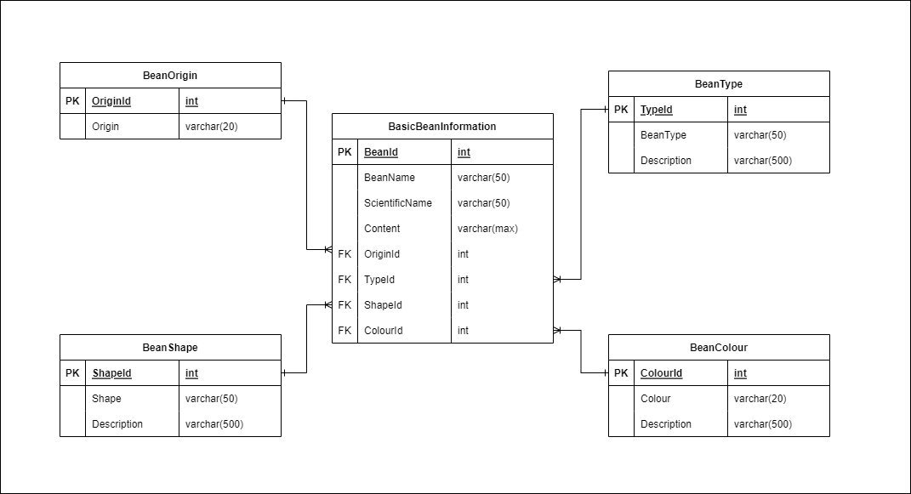

# Project Overview
Welcome Bean Enthusiasts!

Beanpedia is envisioned as a comprehensive digital encyclopedia dedicated to all things beans, offering an extensive database of bean varieties, complete with their colour, size, origin, and type. It aims to serve as a one-stop resource for bean enthusiasts, gardeners, and cooks alike, featuring a rich collection of bean information. By weaving together educational content, culinary inspiration, and practical gardening advice, Beanpedia aspires to celebrate the diversity and significance of beans in cultures around the world, promoting sustainability and a deeper appreciation for this versatile food.

 ``` 
⠀⠀⠀⠀⠀⠀⠀⠀⠀⠀⠀⣀⣀⠀⠀⠀⠀⠀⠀⠀⠀⠀⠀⠀⠀⠀⠀⠀⠀⠀
⠀⠀⠀⠀⠀⠀⠀⠀⠀⢺⣿⣿⣿⣿⣷⣦⣄⠀⠀⠀⠀⠀⠀⠀⠀⠀⠀⠀⠀⠀
⠀⠀⠀⠀⠀⠀⢠⣷⡄⠀⠙⢿⣿⣿⣿⣿⣿⣷⡄⠀⠀⠀⠀⠀⠀⠀⠀⠀⠀⠀
⠀⠀⠀⠀⠀⠀⣸⣿⣿⣦⡀⠀⠙⢿⣿⣿⣿⣿⣿⣆⠀⠀⠀⠀⠀⠀⠀⠀⠀⠀
⠀⠀⠀⠀⠀⠀⢻⣿⣿⣿⣿⣦⣄⠀⠈⠛⠿⣿⣿⣿⡄⠀⠀⠀⠀⠀⠀⠀⠀⠀
⠀⠀⠀⠀⠀⠀⠸⣿⣿⣿⣿⣿⣿⣷⣤⣀⠀⠘⢿⣿⡧⠀⠀⠀⠀⠀⠀⠀⠀⠀
⠀⠀⠀⠀⠀⠀⠀⠹⣿⣿⣿⣿⣿⣿⣿⣿⡆⠀⠘⢁⣴⣾⣿⡿⠋⠀⠀⡀⠀⠀
⠀⠀⠀⠀⠀⠀⠀⠀⠙⣿⣿⣿⣿⣿⣿⣿⠇⢀⣶⣿⣿⣿⠋⠀⢀⣤⣾⣷⠀⠀
⠀⠀⠀⠀⠠⠤⠶⣶⣤⣄⣉⠙⠿⣿⡿⠃⣰⣿⣿⣿⣿⠃⠀⢰⣿⣿⣿⣿⡇⠀
⠀⠀⣤⣤⣤⣄⡀⠈⠻⣿⣿⣷⣦⡈⠁⣼⣿⣿⣿⣿⣿⠀⠀⣿⣿⣿⣿⣿⠃⠀
⠀⢸⣿⣿⣿⣿⣷⠀⠀⢹⣿⣿⣿⣷⡀⢻⣿⣿⣿⣿⣿⠀⠀⢹⣿⣿⣿⡟⠀⠀
⠀⠘⣿⣿⣿⣿⣿⣇⠀⠈⠻⣿⣿⣿⣷⠀⣿⣿⣿⣿⠟⠀⠀⣾⣿⣿⡟⠀⠀⠀
⠀⠀⠙⣿⣿⣿⣿⣿⣦⣀⠀⠀⠉⠛⠻⠀⣿⡿⠟⠁⠀⣠⣾⣿⡿⠋⠀⠀⠀⠀
⠀⠀⠀⠈⠻⢿⣿⣿⣿⣿⣿⣶⣶⠄⠀⠈⠋⠀⢀⣠⣾⡿⠟⠋⠀⠀⠀⠀⠀⠀
⠀⠀⠀⠀⠀⠀⠈⠉⠛⠛⠛⠉⠁⠀⠀⠀⠀⠀⠀⠁⠀⠀⠀⠀⠀⠀⠀⠀⠀⠀⠀
 ```

# Links
## JIRA
- [JIRA]([https://www.google.com](https://beanpedia.atlassian.net/jira/software/projects/BEAN/boards/1))

## Confluence
- [Confluence](https://beanpedia.atlassian.net/wiki/spaces/BEAN)

## Presentation
- [Presentation](https://www.canva.com/design/DAF_Xy_Zv_E/RjFjgamVQ2NJu78pKLgaAg/edit)

# Project Installation

This section of the README will provide instructions to get the project running in a development environment.

## Prerequisites

Before you begin ensure that you have the following installed

- JDK version 21 or higher.
- IntelliJ
- Wix(For building exe on windows)

## Installation Steps

1. **Clone the Repo:**

    ```bash
    git clone https://github.com/BBD-Beanpedia/Beanpedia.git
    ```

2. **Navigate into the cloned directory**
   ```bash
      cd Beanpedia
   ```

3. **Build the multi-project**
   ```bash 
      ./gradle build
   ```
   If the build is successful, you can find the compiled classes and JAR file in the build directory's of backend and cli.

## ERD



## Initial Deployment And Setup

First install NodeJS from https://nodejs.org/en/download/

Then to install the AWS CLI run

 ``` 
 npm i -g aws-cli 
 ```  

Then to configure your AWS CLI credentials run

 ```
 aws configure 
```   

Then to install the AWS CDK run

```  
npm i -g aws-cdk  
```  

Then to deploy the resources required by the AWS CDK to your AWS account, navigate to this project in your terminal and
run

```  
cdk bootstrap  
```

Then to deploy your intial resources run

```
cdk deploy
```

Configure the following repository variables for the actions in GitHub. The deploy role arn can be found  
in AWS IAM roles under the "soccerDbDeployRole".

```  
key: AWS_SECRET_NAME  
value: soccerDbInstanceSecret  
  
key: AWS_DEPLOY_ROLE  
value: <The arn of the deploy role>  
  
key: AWS_REGION  
value: The AWS region to deploy to eg. eu-west-1  
```

To connect to the DB instance  you can SSH tunnel through the EC2 instance usings its IP and SSH KEY store in parameter store

## Physical ERD Diagram Editing

Any changes that need to be made to the physical ERD diagram can be made through the .drawio.png file in the ERD folder.

In order to make theses changes you must:

- Install Visual Studio Code
- Install the `Draw.io Integration` extension by Henning Dieterichs. This unofficial extension integrates an offline version of Draw io into VS Code.
- Open the .draw.io.png file and the Draw io interface will load.
